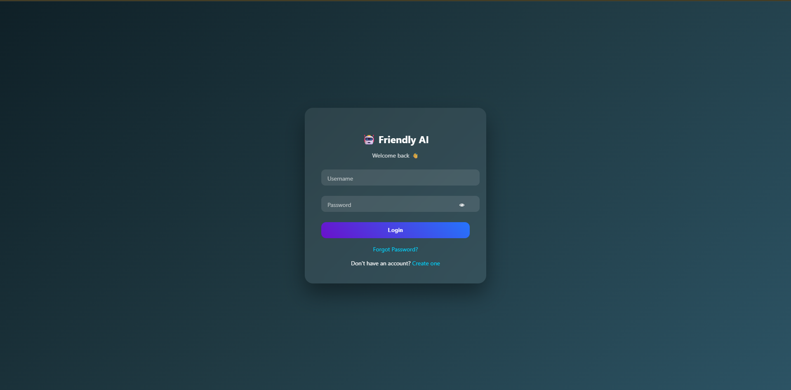
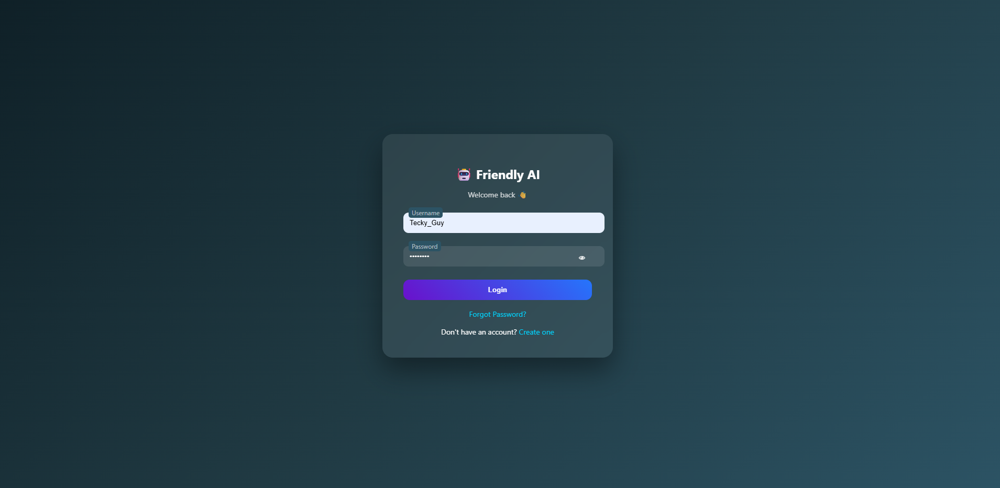
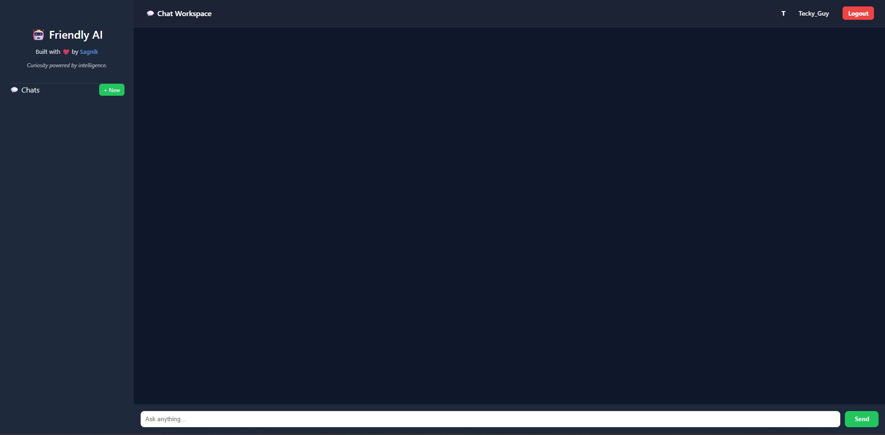
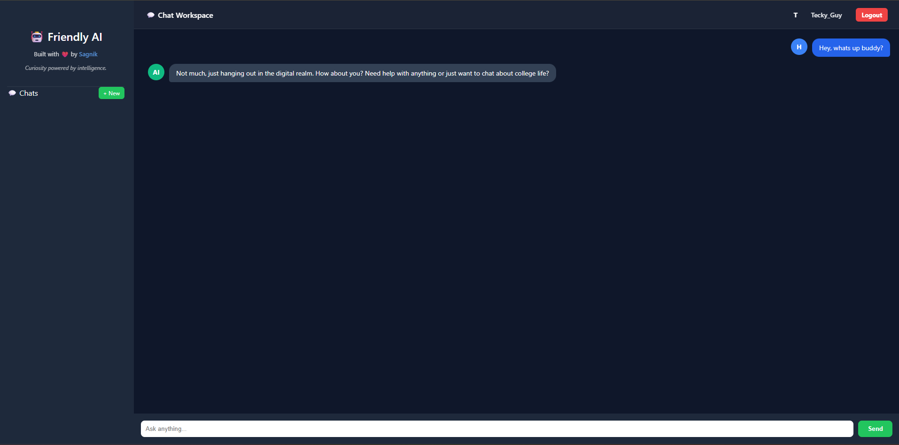

# 🤖 Friendly AI

> Built with ❤️ by Sagnik  
> *Curiosity powered by intelligence.*

Friendly AI is a full-stack AI-powered chatbot application built using Flask and Groq LLM API.  
It features secure authentication, chat history management, a modern UI, and production deployment.

🌐 **Live Demo:** https://your-render-link.onrender.com  
🔗 **GitHub:** https://github.com/iamsagnik15/Friendly-Chatbot

---

## 🚀 Features

- 🔐 User Authentication (Register/Login/Logout)
- 🔑 Secure Password Hashing (Werkzeug)
- 💬 Persistent Chat History (PostgreSQL / SQLite)
- 🧠 AI Integration using Groq LLM (Llama 3.1)
- 🗂️ Delete Single or All Chats
- 🎨 Modern ChatGPT-style UI
- 👤 Profile Avatar & Username Display
- ⚡ Typing Indicator
- 🌍 Production Deployment on Render
- 🔒 Environment Variable Configuration

---

## 🛠 Tech Stack

**Frontend**
- HTML5
- CSS3 (Modern UI Styling)
- JavaScript (Fetch API)

**Backend**
- Python
- Flask
- Flask-Login
- SQLAlchemy

**Database**
- PostgreSQL (Production)
- SQLite (Local Development)

**AI Integration**
- Groq API (Llama 3.1 8B Instant)

**Deployment**
- Render (Cloud Hosting)

---

## 🧠 How It Works

1. User registers and logs in.
2. Password is securely hashed before storing.
3. User sends a message.
4. Backend sends the prompt to Groq LLM.
5. AI response is returned and stored in database.
6. Chat history is displayed in the sidebar.

---

## 🔧 Local Setup Instructions

### 1️⃣ Clone the Repository

```bash
git clone https://github.com/iamsagnik15/Friendly-Chatbot.git
cd Friendly-Chatbot
```

---

### 2️⃣ Create Virtual Environment

```bash
python -m venv venv
venv\Scripts\activate   # Windows
```

---

### 3️⃣ Install Dependencies

```bash
pip install -r requirements.txt
```

---

### 4️⃣ Set Environment Variables

On Windows:

```bash
set GROQ_API_KEY=your_groq_key
set SECRET_KEY=your_secret_key
```

On Mac/Linux:

```bash
export GROQ_API_KEY=your_groq_key
export SECRET_KEY=your_secret_key
```

---

### 5️⃣ Run the Application

```bash
python app.py
```

Open:

```
http://127.0.0.1:5000
```

---

## 🌐 Production Deployment (Render)

- Connected GitHub repository
- Added environment variables:
  - `GROQ_API_KEY`
  - `SECRET_KEY`
  - `DATABASE_URL`
- Used PostgreSQL database
- Gunicorn as production server

---

## 📂 Project Structure

```
Friendly-Chatbot/
│
├── templates/
│   ├── login.html
│   ├── register.html
│   ├── chat.html
│   └── forgot_password.html
│
├── static/
│   └── style.css
│
├── app.py
├── requirements.txt
└── README.md
```

---

## 🔐 Security Practices

- Password hashing using Werkzeug
- Environment variables for API keys
- Database URL secured via Render
- Production-ready configuration

---

## 📸 Screenshots

  🔐 Login Page


  📝 Register Page


  💬 Chat Interface


  🧠 AI Response Example



---

## 📈 Future Improvements

- Google OAuth Login
- Streaming AI Responses
- Light/Dark Mode Toggle
- Chat Titles like ChatGPT
- Token Usage Counter
- Docker Deployment

---

## 🧑‍💻 Author

**Sagnik**

GitHub: https://github.com/iamsagnik15  
Built with curiosity and ambition.

---

## ⭐ If You Like This Project

Give it a star on GitHub!
